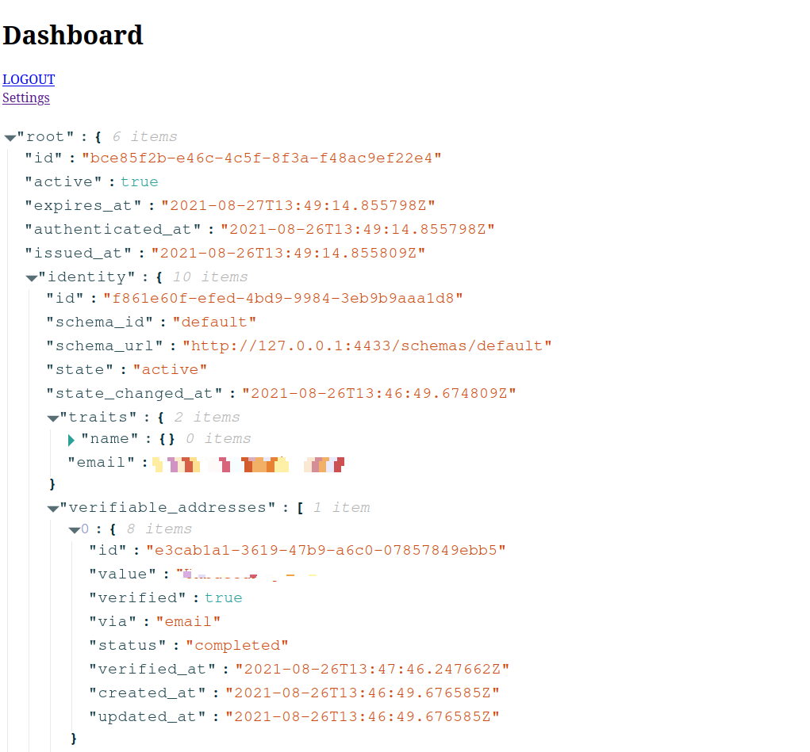

# Ory Kratos Next.Js Self Service Ui Example on typescript.

Extremely simple and minimal self service ui example on implementation of Kratos on Next.js without much abstraction for easier understanding of basic principles.

## Steps.

1. Run the docker by doing `docker-compose up`.
2. It starts the Kratos server at `127.0.0.1:4433`.
3. Run the next js by doing `yarn dev`.
4. Open next js page on `127.0.0.1:3000`.

## Things to consider.

Remember that this example is using github oidc, so before starting it, add client secret and client id in [config](/config/kratos.yml) otherwise it won't start.

## Flows implemented.

- [x] Login
- [x] Register
- [x] Recovery
- [x] Verification
- [x] Dashboard
- [x] Oidc

### FAQs.

There are many things left to implement like unlinking and linking the accounts from settings, but that's out of the scope of this minimal example. I believe rest things can be easily implemented after reading the code.
